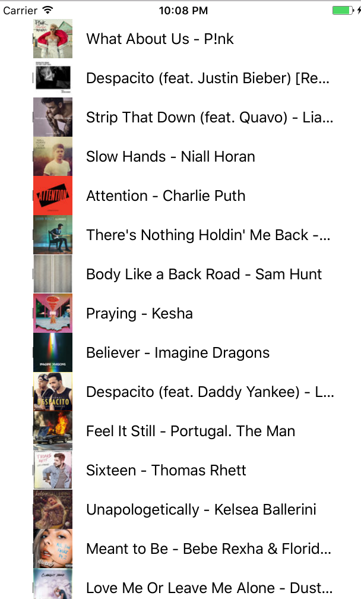

iOS - Swift Practice Repository
=========================

### 1. TopSong With JSON
  - Json Parsing
	- json : [http://ax.itunes.apple.com/WebObjects/MZStoreServices.woa/ws/RSS/topsongs/limit=25/json](http://ax.itunes.apple.com/WebObjects/MZStoreServices.woa/ws/RSS/topsongs/limit=25/json)
	- [http://stack07142.tistory.com/84](http://stack07142.tistory.com/84)

### 2. Sample_Layout
- Layout(code)
	- UIColor
	- Layout constraint
	- addSubView

### 3. iOS_Study_Week_1
- LaunchScreen.storyboard, Main.storyboard
- Layout Constraints
- UIViews(UILabel, UIButton, UITextView)
- IBOutlet, IBAction

### 4. iOS_Study_Week_2
- Sign-In Form Example
	- ImageView
	- StackView
	- Dialog
	- Regular expression
	- Gesture Recognizer
	- UITextFieldDelegate
	- FirstResponder 

### 5. iOS_Study_Week_3
- TableView
	- UITableViewCell

- 화면 전환(Segue)
	- Action Segue
	- Manual Segue
		- performSegue
		- prepare(화면 전환 시 데이터 전달)
		- unWind

- Button이 아닌 View에 리스너 달기
	- extension

- Cocoapod + Toast_Swift 라이브러리 사용

### 6. iOS_Study_Week_4
- TableView를 UITableViewController를 이용하지 않고 사용해보기
	- 채팅 형식 구현
- ScrollView

### 7. iOS_Study_Week_5
- 키패드 처리
	- 여백 터치 시 키패드 닫기
	- 키패드 열릴 때 뷰 움직이기
- TableView 채팅 예제에서 TableView 새로고침

### 8. iOS_Study_Week_6
- ScrollView Paging

